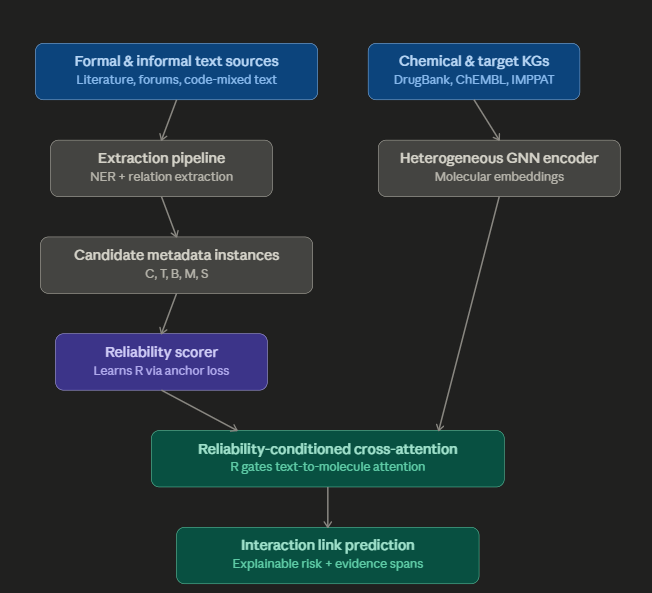

# Reliability-Conditioned Herb-Drug Interaction Prediction

> **A method for predicting novel herb-drug interactions via graph neural network link prediction, in which a learned reliability score dynamically gates the cross-attention weights fusing heterogeneous textual embeddings with molecular graph embeddings.**

[](https://www.python.org/downloads/)
[](https://pytorch.org/)
[](LICENSE)

## Architecture



Two parallel paths converge at the **reliability-conditioned cross-attention layer**:

1. **Text Path**: Formal & informal text sources → NER + relation extraction → candidate metadata instances (C, T, B, M, S) → reliability scorer → R
2. **Graph Path**: Chemical/target knowledge graphs (DrugBank, ChEMBL, IMPPAT) → heterogeneous GNN encoder → molecular embeddings
3. **Fusion**: R-gated cross-attention (reliability score dynamically scales text-to-molecule attention weights) → interaction link prediction with explainable risk scores and evidence spans

### Core Innovation

The reliability score **R** — computed from source metadata (corroboration count, temporal recency, biomedical quality, molecular plausibility, source type) — acts as a **dynamic gate on cross-attention weights**. This resolves the multimodal alignment problem between fixed-dimension molecular graph embeddings and noisy, variable-length, code-mixed textual embeddings.

**Three-way differentiation from 2026 prior art:**
- vs. **BELIEF**: Dempster-Shafer fusion for closed-set QA — no graph link prediction
- vs. **NeuroGRIP**: Post-hoc reliability filter on homogeneous graphs — no cross-modal fusion
- vs. **DDI-AttendNet**: Intra-modal molecular substructure attention — no text-molecule bridging

## Project Structure

```
├── configs/
│   └── default.yaml           # Centralized configuration
├── src/
│   ├── data/                  # Data loading & preprocessing
│   │   ├── drugbank_loader.py
│   │   ├── chembl_loader.py
│   │   ├── imppat_loader.py
│   │   ├── corpus_loader.py
│   │   ├── code_mixed_loader.py
│   │   └── dataset.py
│   ├── extraction/            # NLP extraction pipeline
│   │   ├── ner_model.py
│   │   ├── relation_extractor.py
│   │   ├── entity_linker.py
│   │   └── candidate_metadata.py
│   ├── graph/                 # Knowledge graph construction
│   │   ├── kg_builder.py
│   │   └── graph_utils.py
│   ├── models/                # Neural network models
│   │   ├── gnn_encoder.py     # Heterogeneous GNN (RGCN/HGT)
│   │   ├── text_encoder.py    # Biomedical text encoder
│   │   ├── reliability_scorer.py  # R-score from metadata
│   │   ├── cross_attention.py # Reliability-conditioned cross-attention ★
│   │   ├── link_predictor.py  # Link prediction head
│   │   └── hdi_model.py       # Full end-to-end model
│   ├── training/              # Training & evaluation
│   │   ├── trainer.py
│   │   ├── evaluator.py
│   │   └── ablation.py
│   └── explainability/        # Explainable output
│       └── evidence_surfacer.py
├── app/
│   ├── backend.py             # FastAPI serving
│   └── frontend.py            # Streamlit demo
├── tests/                     # Unit tests
├── data/                      # Data directory (gitignored)
├── checkpoints/               # Model checkpoints (gitignored)
├── STATUS_AND_PROGRESS.md     # Living progress tracker
└── requirements.txt
```

## Setup

```bash
# Clone the repository
git clone https://github.com/jiya2000/Reliability-Conditioned-Herb-Drug-Interaction-Prediction.git
cd Reliability-Conditioned-Herb-Drug-Interaction-Prediction

# Create virtual environment
python -m venv venv
source venv/bin/activate  # On Windows: venv\Scripts\activate

# Install dependencies
pip install -r requirements.txt

# Install project in development mode
pip install -e .
```

## Configuration

All parameters are centralized in `configs/default.yaml`. Key sections:
- **data**: Paths to raw/processed datasets
- **extraction**: NLP model choices and hyperparameters
- **gnn**: Graph neural network architecture
- **reliability**: Metadata dimension sizes for the R-scorer
- **cross_attention**: Core fusion layer configuration
- **training**: Learning rate, epochs, negative sampling

## Usage

### Training
```bash
python -m src.training.trainer --config configs/default.yaml
```

### Ablation Study
```bash
python -m src.training.ablation --config configs/default.yaml
```

### Demo Application
```bash
# Start FastAPI backend
uvicorn app.backend:app --host 0.0.0.0 --port 8000

# Start Streamlit frontend (in another terminal)
streamlit run app/frontend.py
```

## Datasets

| Dataset | Purpose | Access |
|---------|---------|--------|
| DrugBank | Drug-drug interactions, drug metadata | Academic license |
| ChEMBL | Bioactivity data, molecular structures | Open access |
| IMPPAT 2.0 | Indian medicinal plant phytochemicals | Request access |
| DDI Corpus | Annotated DDI sentences | Open access |
| CADEC | Consumer adverse drug events | Open access |
| PsyTAR | Psychiatric drug reviews | Open access |
| UMLS | Biomedical concept normalization | NLM license |

## Tech Stack

| Layer | Tools |
|-------|-------|
| NER / RE | HuggingFace Transformers, scispaCy, BioBERT, IndicBERT/MuRIL |
| Entity Linking | UMLS API, rapidfuzz, embedding similarity |
| Knowledge Graph | NetworkX, PyTorch Geometric |
| GNN + Fusion | PyTorch, PyTorch Geometric |
| Serving | FastAPI, Streamlit |
| Tracking | Weights & Biases |

## License

MIT License — see [LICENSE](LICENSE) for details.
